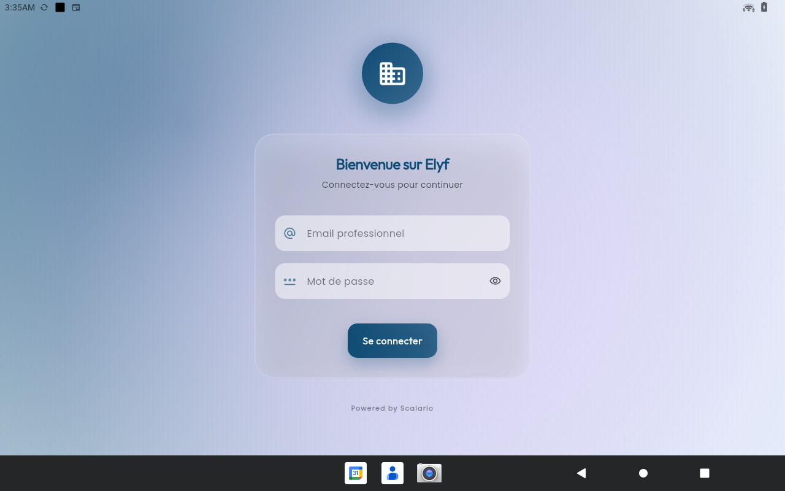
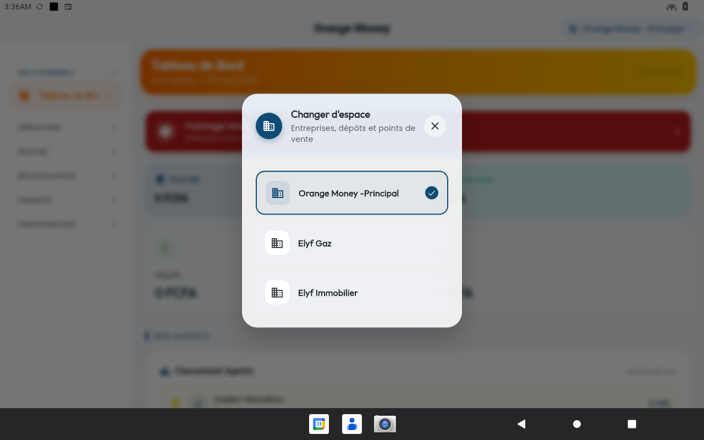
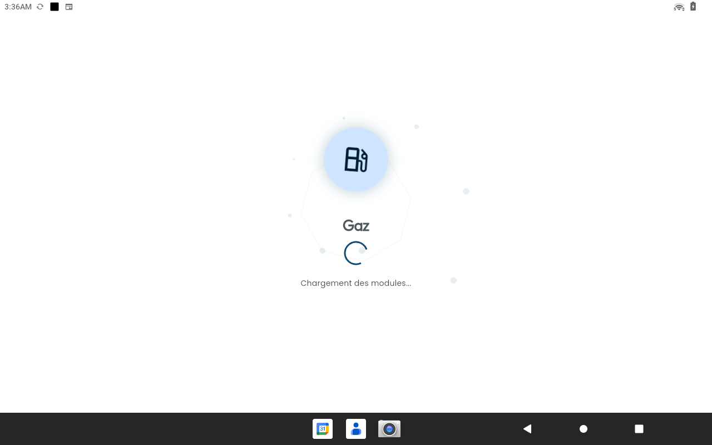

# Portfolio — ELYF Group App

Application Flutter multi-entreprises (ERP multi-tenant) pour piloter
plusieurs activités commerciales depuis une seule app — offline-first,
role-aware, intégration matérielle native (imprimantes thermiques Sunmi).

> Conçue et développée par **Carlos Simporé** — Founder, [Scalario Labs](https://scalario.com).
> ELYF Group est l'entreprise cliente exploitant l'application.

| | |
| --- | --- |
| 📲 **Télécharger l'APK** | [elyf-app-portal--elyf-group-app.us-east4.hosted.app](https://elyf-app-portal--elyf-group-app.us-east4.hosted.app/) |
| 🌐 **Console admin (web)** | [elyf-group-app.web.app](https://elyf-group-app.web.app/) |

---

## Vue d'ensemble

ELYF Group App regroupe 6 modules métier indépendants partageant une
même base technique (auth, multi-tenant, sync offline, trésorerie, audit
trail, permissions, notifications). Chaque module est conçu pour un métier
réel exercé sur le terrain au Burkina Faso.

### Stack technique

| Couche | Technologies |
| --- | --- |
| **Frontend** | Flutter 3.29+ · Dart 3.7+ · Material Design 3 |
| **State management** | Riverpod 3 (providers, AsyncValue, family) |
| **Local DB / offline** | Drift (SQLite) — offline-first sur tous les modules opérateur |
| **Backend** | Firebase Auth · Firestore · Cloud Functions · FCM · Firebase Storage |
| **Architecture** | Clean Architecture · Feature-First · Repository pattern |
| **Matériel** | Sunmi V3 Mix (impression thermique native), partage PDF système |
| **CI/CD** | GitHub Actions · Shorebird (hotfix OTA) |
| **Distribution** | APK signé → Firebase Storage (lien permanent) + GitHub Release |

### Fonctionnalités transverses

- 🔐 **Auth Firebase** — login email/password, sessions sécurisées
- 🏢 **Multi-tenant** — switch entre entreprises sans reconnexion
- 📱 **Offline-first** — Drift (SQLite) en local, sync Firestore en arrière-plan
- 🛂 **Permissions granulaires** — rôles par module (Manager / POS / Agent / Dealer…)
- 🖨️ **Impression thermique** — tickets, reçus, rapports via Sunmi V3 Mix
- 📊 **Dashboards rôle-conscients** — chaque rôle voit son propre tableau de bord
- 🔍 **Audit trail** — traçabilité des actions critiques
- 💰 **Trésorerie multi-comptes** — Caisse + Mobile Money par module
- 🔔 **Notifications push** — FCM + notifications en-app

---

## Écrans transverses

Trois écrans communs à toute l'application — point d'entrée, switch
multi-tenant, splash de chargement de module.

| Login | Switch d'espace | Chargement module |
| --- | --- | --- |
|  |  |  |
| Écran d'accueil « Bienvenue sur Elyf » — auth Firebase email/mot de passe. | Popup Changer d'espace — passage rapide entre Orange Money Principal, Elyf Gaz, Elyf Immobilier… | Splash module-aware (ici Gaz) — initialisation Drift, sync, permissions. |

---

## Modules d'entreprise

Tous les modules ci-dessous sont alignés sur l'implémentation réelle
(avril 2026), avec des screenshots capturés sur tablette en conditions
réelles d'exploitation.

### [Eau Minérale](./eau_minerale/) ✅

Usine de production et distribution d'eau en sachets/packs.

- 🏭 Sessions de production multi-jours (machines, bobines, matières, personnel)
- 📦 Stock bi-niveau (matières premières + produits finis)
- 🛒 Achats fournisseurs (comptant ou crédit, support lots)
- 💰 Ventes (cash / mobile money / mixte / crédit client)
- 💳 Crédits clients + encaissements
- 💵 Trésorerie multi-comptes
- 💸 Dépenses & rapports mensuels
- 👷 Salaires (employés fixes + ouvriers payés à la production)
- 📊 Rapports PDF (KPIs, tendances, ventilations)
- ⚙️ Parc machines + maintenance

**31 screenshots** · [📖 Documentation →](./eau_minerale/)

---

### [Gaz](./gaz/) ✅

Distribution de bouteilles de gaz — gros & détail.

- 🚚 **Tournées multi-étapes** : Collecte vides → Recharge fournisseur → Livraison → Encaissement → Bilan → Clôture
- 🏪 Réseau de **POS affiliés** (succursales ou comptoirs simples)
- 🧑‍💼 Annuaire **grossistes B2B**
- 🛢️ Stock bi-modal (pleines / vides) par poids (3 kg, 6 kg, 10 kg, 12 kg)
- 💰 Versements POS → maison mère
- 🧾 Reçus PDF et partage natif (Drive, Bluetooth, Gmail…)
- ⚙️ Parc de bouteilles enregistré + tarification consigne

**Vues Manager + POS** · [📖 Documentation →](./gaz/)

---

### [Orange Money](./orange_money/) ✅

Opérations cash-in / cash-out pour agents Orange Money agréés.

Deux rôles distincts :

- **Dealer** — pilote le réseau d'agents, supervise les liquidités, distribue les commissions
- **Agent** — exécute les transactions client (4 étapes), gère sa caisse quotidienne

Fonctionnalités :

- 💵 Transactions cash-in / cash-out / dépôt / retrait
- 🏧 **Déclaration matinale** + **bilan quotidien**
- 📊 Saisie manuelle mensuelle des commissions (avec preuve photo)
- 💰 Suivi de liquidité (checkpoints horodatés)
- 📈 Trésorerie consolidée par dealer / agent

[📖 Documentation →](./orange_money/)

---

### [Boutique](./boutique/) ✅

Point de vente (POS) commerce de détail.

- 🛒 Caisse temps réel avec scan code-barres + panier persistant
- 📦 Catalogue produits (catégories, photos, historique des prix, soft delete)
- 📥 Inventaire & mouvements de stock (réception, ajustement)
- 💵 Trésorerie multi-comptes (Caisse + Mobile Money)
- 🧾 **Chaînage cryptographique des tickets** (`ticketHash` / `previousHash`) pour audit
- 💳 Créances clients (ventes à crédit, encaissements partiels)
- 💸 Dépenses opérationnelles avec impact direct trésorerie
- 🖨️ Impression Sunmi native

[📖 Documentation →](./boutique/)

---

### [Immobilier](./immobilier/) ✅

Gestion d'un portefeuille de propriétés en location.

- 🏠 Catalogue de propriétés (statut occupation, loyer mensuel)
- 👥 Annuaire locataires (à jour / en retard)
- 💰 Encaissement de loyers — assistant 2 étapes (Locataire → Maison → Mois à payer)
- ⚠️ Suivi des loyers en retard avec relance
- 💸 Dépenses rattachées à une propriété
- 💵 Trésorerie consolidée (caisse + banque)
- 📊 Rapports analytiques (revenus, dépenses, bénéfice net, taux d'occupation)

[📖 Documentation →](./immobilier/)

---

### [Administration](./admin/) ✅

Console de pilotage 360° du groupe — vue transverse sur toutes les entreprises.

- 📈 **Dashboard groupe** — KPIs consolidés (CA, Dépenses, Bénéfice net, Marge) avec graphique d'évolution journalière, filtres période
- 🏢 **Organisation** — liste de toutes les entreprises, fiche live par entreprise avec onglets adaptés au métier (pattern Strategy)
- 🚚 **Vue Gaz** — historique tours (en cours en tête), fiche tour live avec Bilan · Recharge · POS · Grossistes · Timeline
- 📦 **Vue Eau Minérale** — stock, appros admin directes avec support lots et notification automatique au user
- 🛒 **Vue Boutique** — performance, stock, trésorerie par point de vente
- 👥 **Accès** — gestion utilisateurs et rôles par module
- 🔍 **Audit trail** — toutes les actions critiques tracées
- ⚡ Lecture Firestore live (pas de Drift côté admin — données toujours fraîches)

**3 screenshots** · [📖 Documentation →](./admin/)

---

## Architecture globale

### Clean Architecture & Feature-First

```text
lib/
├── app/                       # Configuration globale (router, theme)
├── core/                      # Services transverses
│   ├── auth/                 # Authentification Firebase
│   ├── firebase/             # Wrappers Firestore, Functions, FCM
│   ├── offline/              # Drift (SQLite) + sync layer
│   ├── printing/             # Intégration Sunmi V3
│   ├── permissions/          # Système de permissions par module
│   └── tenant/               # Multi-tenant (active enterprise)
├── features/                  # Modules métier (feature-first)
│   ├── eau_minerale/
│   ├── gaz/
│   ├── orange_money/
│   ├── boutique/
│   ├── immobilier/
│   └── administration/
└── shared/                    # Widgets et utilitaires partagés
```

### Structure d'un module

Chaque feature suit la même structure en couches :

```text
features/<module>/
├── presentation/    # Screens, widgets, dialogs
├── application/     # Controllers Riverpod, services métier
├── domain/          # Entités pures, value objects, énumérés
└── data/            # Repositories (Firestore + Drift), datasources
```

---

## Tests

52 fichiers de tests couvrant les couches critiques de l'application :

| Catégorie | Fichiers | Périmètre |
| --- | --- | --- |
| **Domain services** | 17 | Calculs métier (production, ventes, crédits, rapports, validation) — Eau Minérale, Gaz, Boutique, Immobilier, Orange Money |
| **Controllers** | 12 | Logique applicative Riverpod — Gaz (5), Immobilier (5), Administration (2) |
| **Repositories** | 4 | Couche Drift (SQLite) — Boutique, Eau Minérale, Gaz, Orange Money |
| **Core offline** | 3 | Sync Firestore → Drift, résolution de conflits |
| **Intégration** | 2 | Multi-tenant, offline sync end-to-end |
| **Widgets** | 8 | Composants partagés (navigation, layout, états vides, erreurs) |

Les services de calcul (règles de gestion pures, sans dépendances externes)
sont prioritairement couverts car ils concentrent la complexité métier.

---

## Sécurité & conformité

- Auth Firebase avec tokens sécurisés et règles Firestore par tenant
- Validation côté serveur (Cloud Functions)
- Chaînage cryptographique des tickets de caisse (Boutique)
- Audit trail des actions critiques
- Permissions granulaires par module et par rôle
- Soft delete avec `deletedAt` / `deletedBy`

---

## Métriques

| Métrique | Valeur |
| --- | --- |
| **Modules métier** | 6 opérationnels + console administration |
| **Screens** | 120+ |
| **Lignes de code** | ~60 000+ |
| **Plateformes** | Android (cible principale, tablettes Sunmi) · Web (admin) |
| **Mode offline** | ✅ Complet sur tous les modules opérateur |
| **Synchronisation** | ✅ Automatique en arrière-plan (Drift → Firestore) |
| **Hotfix OTA** | ✅ Shorebird |
| **Distribution APK** | ✅ Firebase Storage (lien permanent par release) |
| **CI/CD** | ✅ GitHub Actions — build APK + upload Storage + GitHub Release |

---

## Auteur

**Carlos Simporé** — Founder, Scalario Labs

Architecte, développeur et designer unique de l'application ELYF Group App.
Conception produit, modélisation métier, implémentation Flutter/Firebase,
intégration matérielle (Sunmi), CI/CD et déploiement — réalisés en solo.

> ELYF Group est l'entreprise cliente exploitant l'application sur le
> terrain au Burkina Faso.

### Licence

Propriétaire — Scalario Labs © 2026 · Exploité sous licence par ELYF Group.

---

> État : ✅ Tous les modules alignés sur l'implémentation — Avril 2026 · v0.1.24
