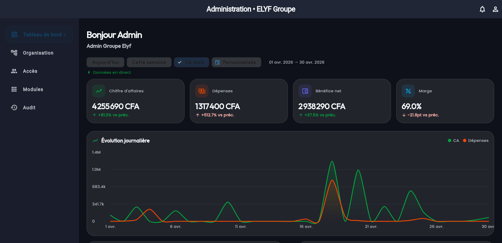
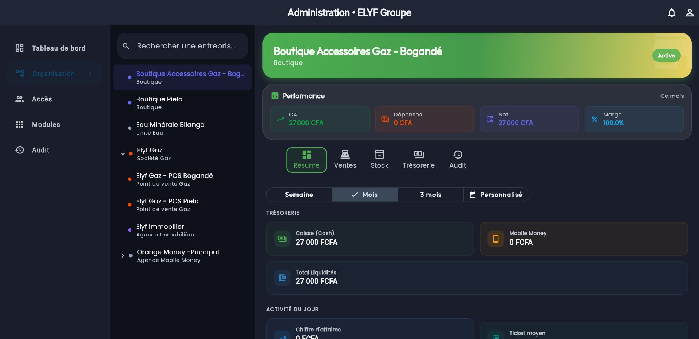
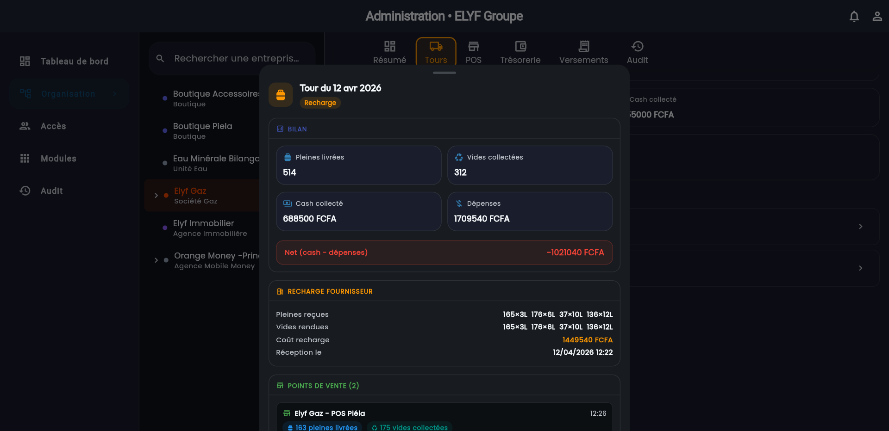

# Module Administration — ELYF Group App

## 🎯 Vue d'Ensemble

Le module **Administration** est la **console de pilotage 360° du groupe**
ELYF : une vue transverse sur **toutes les entreprises** et **tous les
modules** depuis un seul écran, réservé aux admins du groupe.

Contrairement aux apps opérateur (offline-first sur Drift), le module admin
lit **exclusivement Firestore** (données toujours fraîches, pas de cache
local) — et utilise un **pattern Strategy** pour adapter la fiche de chaque
entreprise à son métier.

> Rôle réservé aux admins du groupe — aucun accès depuis les apps opérateur.

### Caractéristiques Principales

- 📈 **Dashboard groupe** — KPIs consolidés (CA, Dépenses, Bénéfice net, Marge) + graphique d'évolution journalière, filtres période
- 🏢 **Organisation** — toutes les entreprises, fiche live avec onglets adaptés au métier (pattern Strategy)
- 🚚 **Vue Gaz** — historique des tours + fiche tour live (Bilan · Recharge · POS · Grossistes · Timeline)
- 📦 **Vue Eau Minérale** — stock + appros admin directes avec notification automatique
- 🛒 **Vue Boutique** — performance, stock, trésorerie par point de vente
- 👥 **Accès** — gestion des utilisateurs et rôles par module
- 🔍 **Audit trail** complet + 🔔 notifications groupe
- ⚡ Lecture **Firestore live** — données toujours fraîches

Code source : [lib/features/administration/](../../lib/features/administration/)

---

## ✨ Fonctionnalités Implémentées

### 1. Tableau de Bord Groupe

[admin_dashboard_section.dart](../../lib/features/administration/presentation/screens/sections/admin_dashboard_section.dart)

- **KPIs consolidés** (CA, Dépenses, Bénéfice net, Marge) filtrables par
  période (Aujourd'hui / Semaine / Mois / Personnalisée)
- **Graphique d'évolution journalière** CA vs Dépenses
- Données en direct (**Firestore live** — pas de cache Drift côté admin)

### 2. Organisation — Stratégie par entreprise

[dashboard_strategy.dart](../../lib/features/administration/presentation/screens/sections/strategies/dashboard_strategy.dart)

- **Liste de toutes les entreprises** du groupe (type et statut), recherche par nom
- Chaque fiche adopte des onglets **adaptés au métier** (pattern Strategy) :

| Type d'entreprise | Onglets de la fiche |
| --- | --- |
| **Boutique** | Performance · Ventes · Stock · Trésorerie · Audit |
| **Gaz (mère)** | Résumé · Tours · POS · Trésorerie · Versements · Audit |
| **Gaz POS** | Performance · Stock · Trésorerie · Audit |
| **Eau Minérale** | Vue 360° stock, appros, historique |
| **Orange Money** | Dashboard commissions, déclarations |
| **Immobilier** | Propriétés, locataires, encaissements |

### 3. Vue Gaz — Tours

- 📋 Historique des tours trié : **en cours d'abord**, puis clôturés, annulés
- 🔍 **Fiche tour complète** (bottom sheet) : Bilan · Départ · Recharge
  fournisseur · POS · Grossistes · Dépenses transport · Stock restant · Timeline
- Statuts tous couverts : Ouvert · Collecte · Recharge · Livraison · Encaissement · Clôture · Clôturé · Annulé
- Passages multiples sur le même site **fusionnés** (un grossiste visité deux
  fois n'apparaît qu'une fois, quantités cumulées)
- Bilan « Vides collectées » exclut les échanges grossistes

### 4. Accès & Audit

- 👥 Gestion des utilisateurs et rôles par module
- 🔍 **Audit trail** complet (toutes les actions critiques tracées)
- 🔔 **Notifications** groupe

---

## 📸 Screenshots

### Tableau de bord groupe



> Dashboard admin — KPIs groupe consolidés (CA 4 255 690 CFA · Bénéfice
> 2 938 290 CFA · Marge 69%) avec graphique d'évolution journalière sur le mois.

---

### Vue organisation — fiche entreprise



> Liste du groupe (à gauche) + fiche **Boutique Accessoires Gaz - Bogandé**
> avec onglets Performance · Ventes · Stock · Trésorerie · Audit.
> KPIs du mois : CA 27 000 CFA, Net 27 000 CFA, Marge 100%.

---

### Fiche tour Gaz — détail complet



> Bottom sheet du tour du 12 avr 2026 (statut Recharge) — section Bilan
> (514 pleines livrées · 312 vides collectées · 688 500 FCFA cash · Net
> −1 021 040 FCFA) et section Recharge Fournisseur avec détail par poids.

---

## 🏗️ Architecture technique (admin)

Le module admin lit **exclusivement Firestore** (pas de Drift) via des
loaders dédiés (`AdminGazLoader`, `AdminBoutiqueLoader`, `AdminEauLoader`…)
pour ne pas dépendre de la sync layer des modules opérateur, souvent vide
sur le device admin.

```
features/administration/
├── data/services/
│   ├── admin_gaz_loader.dart           # Stream live Firestore (tours, ventes, stocks…)
│   ├── admin_boutique_loader.dart
│   ├── admin_eau_loader.dart
│   ├── admin_immobilier_loader.dart
│   ├── admin_om_loader.dart
│   ├── admin_financial_data_loader.dart
│   └── admin_supply_service.dart       # Appros admin → PO + notification user
├── application/providers/
│   ├── admin_gaz_providers.dart
│   ├── admin_audit_providers.dart
│   └── …
└── presentation/screens/sections/
    ├── admin_dashboard_section.dart    # Dashboard groupe
    ├── admin_organizational_section.dart
    ├── admin_enterprise_management_section.dart
    ├── admin_access_section.dart
    ├── admin_audit_trail_section.dart
    └── strategies/
        └── dashboard_strategy.dart     # Interface + `fromEnterprise` (pattern Strategy)
```

**Pattern Strategy** : `EnterpriseDashboardStrategy` expose une interface
(`getTabs` / `buildTabContent`) et `EnterpriseDashboardStrategy.fromEnterprise()`
retourne la stratégie du type d'entreprise ; `_GroupStrategy` décline les onglets
par permission. Ajouter un nouveau type ne modifie pas le shell.

---

## 🔗 Liens Utiles

- 📁 [Code source du module](../../lib/features/administration/)
- 🏠 [Retour au Portfolio](../)

---

## 📝 Notes

> **État de la Documentation** : ✅ Aligné sur l'implémentation (avril 2026)  
> **Rôle** : Administration groupe (réservé aux admins)  
> **Dernière Mise à Jour** : Avril 2026
