# Module Boutique — ELYF Group App

## 🎯 Vue d'Ensemble

Le module **Boutique** est un point de vente (POS) complet pour commerce de
détail. Il couvre le catalogue produit, la caisse en temps réel, la gestion
d'inventaire, le suivi des créances clients, la trésorerie multi-comptes et
les dépenses opérationnelles.

L'architecture est **offline-first** : toutes les opérations passent par une
base locale (Drift) et se synchronisent ensuite avec le backend. Le module
intègre nativement les **imprimantes thermiques Sunmi** pour les tickets de
caisse.

### Caractéristiques Principales

- 🛒 **Point de Vente** — caisse temps réel avec scan code-barres et panier
- 📦 **Catalogue & Inventaire** — produits, catégories, stock, mouvements
- 💵 **Trésorerie** — soldes Cash / Mobile Money + opérations
- 🧾 **Créances** — suivi des ventes à crédit
- 💸 **Dépenses** — gestion financière des charges
- 🖨️ **Impression Sunmi** — tickets thermiques natifs
- 🔌 **Offline-first** — Drift local + sync backend

---

## 🧩 Architecture Fonctionnelle

Navigation latérale en 4 sections (visibilité conditionnée par les
permissions [boutique_permissions.dart](../../lib/core/permissions/modules/boutique_permissions.dart)) :

| Section | Écrans |
| --- | --- |
| **Ventes** | Caisse (POS) |
| **Stock** | Catalogue · Inventaire |
| **Finances** | Trésorerie · Créances · Dépenses |
| **Configuration** | Profil & paramètres |

Code source : [lib/features/boutique/](../../lib/features/boutique/)

---

## ✨ Fonctionnalités Implémentées

### 1. Point de Vente (POS)

Implémenté dans
[pos_screen.dart](../../lib/features/boutique/presentation/screens/sections/pos_screen.dart).

- Recherche produit (texte + scan code-barres via
  [barcode_scanner_widget](../../lib/features/boutique/presentation/widgets/barcode_scanner_widget.dart))
- Filtres par catégorie
- **Panier latéral** persistant (mise en attente : `boutique_held_cart`)
- Remise % au niveau panier
- **Checkout** avec choix du mode de paiement (Espèces, Mobile Money, mixte)
- **Historique des ventes** dans un bottom sheet sticky
- Impression du ticket (Sunmi) à la validation
- **Hash de chaînage** des tickets (`ticketHash`, `previousHash`) — intégrité
  séquentielle des ventes pour audit

### 2. Catalogue Produits

Implémenté dans
[catalog_screen.dart](../../lib/features/boutique/presentation/screens/sections/catalog_screen.dart).

- Liste filtrable par recherche + catégorie
- Création / édition d'un produit avec :
  - Nom, prix de vente, catégorie
  - Stock initial, prix d'achat, code-barres, seuil d'alerte
  - Photo (galerie ou appareil photo)
- **Historique des prix** consultable par produit
- Activation / archivage (`isActive`) + soft delete (`deletedAt`, `deletedBy`)
- Modèle :
  [product.dart](../../lib/features/boutique/domain/entities/product.dart)
  — calcule automatiquement marge et pourcentage de marge

### 3. Inventaire & Mouvements

Implémenté dans
[stock_screen.dart](../../lib/features/boutique/presentation/screens/sections/stock_screen.dart)
et
[stock_movement_screen.dart](../../lib/features/boutique/presentation/screens/sections/stock_movement_screen.dart).

- KPIs : valeur totale du stock, articles en stock, articles en rupture
- État du stock actuel produit par produit
- **Réception de stock** via dialog (entrée de marchandises)
- Ajustement de stock manuel avec motif
- Historique des mouvements pour audit

### 4. Trésorerie

Implémenté dans
[treasury_screen.dart](../../lib/features/boutique/presentation/screens/sections/treasury_screen.dart).

- Soldes consolidés **Caisse (Espèces)** et **Mobile Money**
- 4 opérations rapides : `Apport`, `Retrait`, `Transfert`, `Ajustement`
- Historique des mouvements horodaté
- Refresh manuel des soldes

### 5. Créances

Implémenté dans
[credits_screen.dart](../../lib/features/boutique/presentation/screens/sections/credits_screen.dart).

- Total créances en cours calculé depuis les ventes non soldées
- Liste des ventes à crédit avec montant restant dû
- Encaissement partiel ou total d'une créance
- Une vente est créée comme créance dès lors que `amountPaid < totalAmount`
  (cf.
  [sale.dart](../../lib/features/boutique/domain/entities/sale.dart) :
  `isCredit`, `remainingAmount`, `isFullyPaid`)

### 6. Gestion Financière — Dépenses

Implémenté dans
[expenses_screen.dart](../../lib/features/boutique/presentation/screens/sections/expenses_screen.dart).

- Total des dépenses du jour + résumé mensuel
- Saisie d'une nouvelle dépense :
  - Montant FCFA, motif, catégorie
  - Date de dépense
  - **Mode de paiement** (Espèces ou Mobile Money) — décrémente le bon compte
    de trésorerie via
    [expense_balance_adapter.dart](../../lib/features/boutique/domain/adapters/expense_balance_adapter.dart)
  - Notes optionnelles
  - Photo du reçu (galerie ou appareil photo)
- Tableau filtrable et résumé mensuel agrégé

### 7. Modules avancés (présents dans le code)

Le code source contient également des écrans non encore exposés dans la
navigation principale capturée :

- [purchases_screen.dart](../../lib/features/boutique/presentation/screens/sections/purchases_screen.dart) — gestion des achats fournisseurs
- [suppliers_screen.dart](../../lib/features/boutique/presentation/screens/sections/suppliers_screen.dart) — annuaire fournisseurs + règlements
- [reports_screen.dart](../../lib/features/boutique/presentation/screens/sections/reports_screen.dart) — rapports & clôtures
- [category_management_screen.dart](../../lib/features/boutique/presentation/screens/sections/category_management_screen.dart) — gestion des catégories
- [sales_screen.dart](../../lib/features/boutique/presentation/screens/sections/sales_screen.dart) — historique global des ventes

---

## 📸 Screenshots

> Captures réalisées sur tablette en mode clair (compte boutique fraîchement
> initialisé — montants et listes à zéro).

### 1. Ventes — Point de Vente

| Caisse | Historique des ventes |
| --- | --- |
| 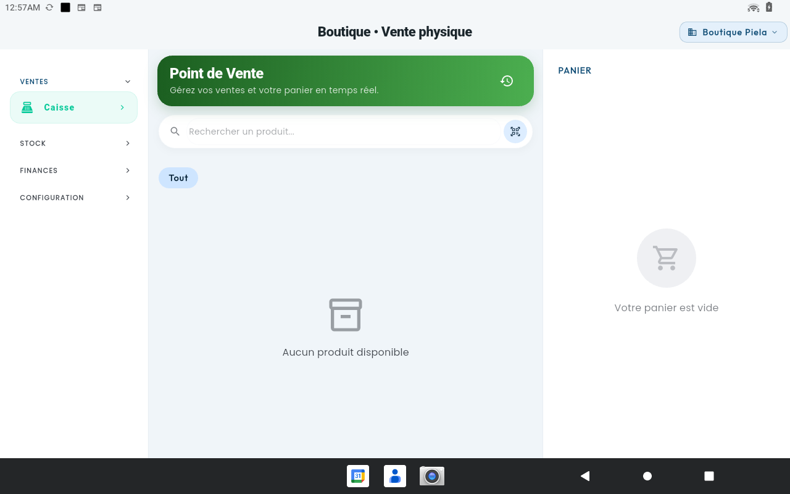 | 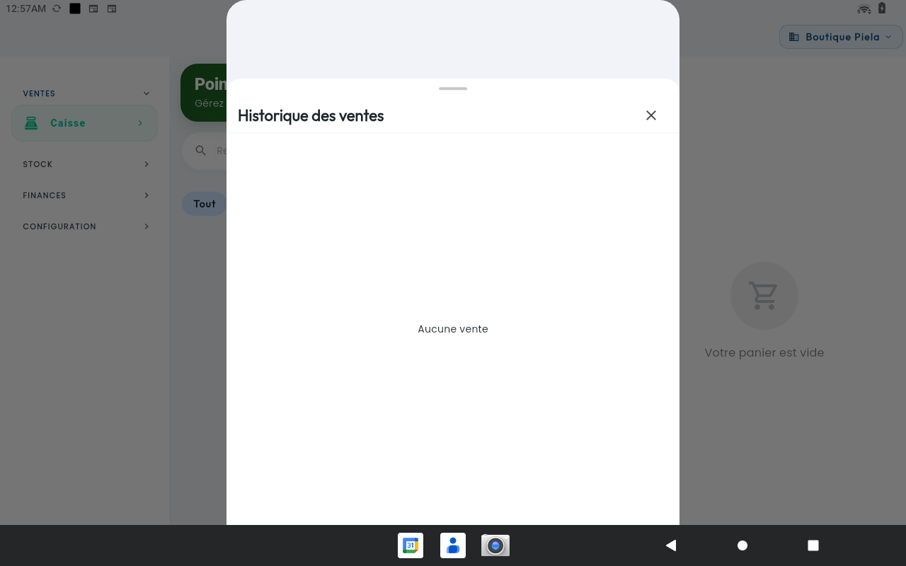 |
| Recherche produit, filtres catégorie, panier latéral persistant. | Bottom sheet sticky listant les ventes du jour. |

### 2. Stock

| Catalogue | Nouveau produit |
| --- | --- |
| 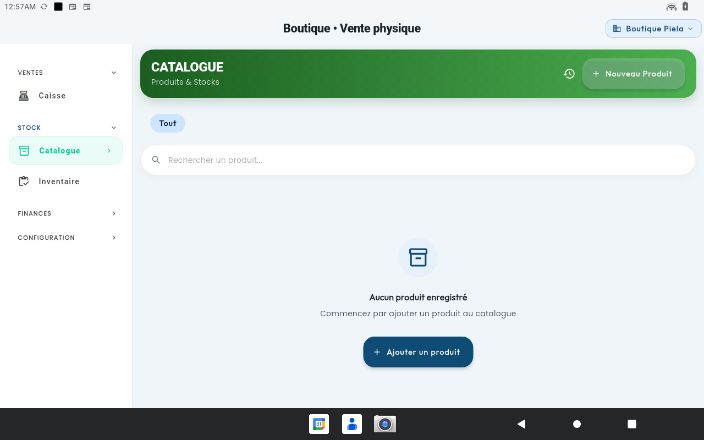 | 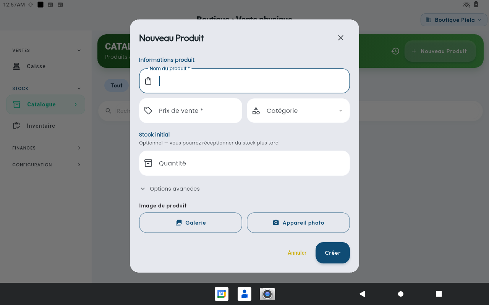 |
| Liste filtrable par catégorie avec recherche. | Création : nom, prix, catégorie, stock, photo. |

| Inventaire | Réception de stock |
| --- | --- |
| 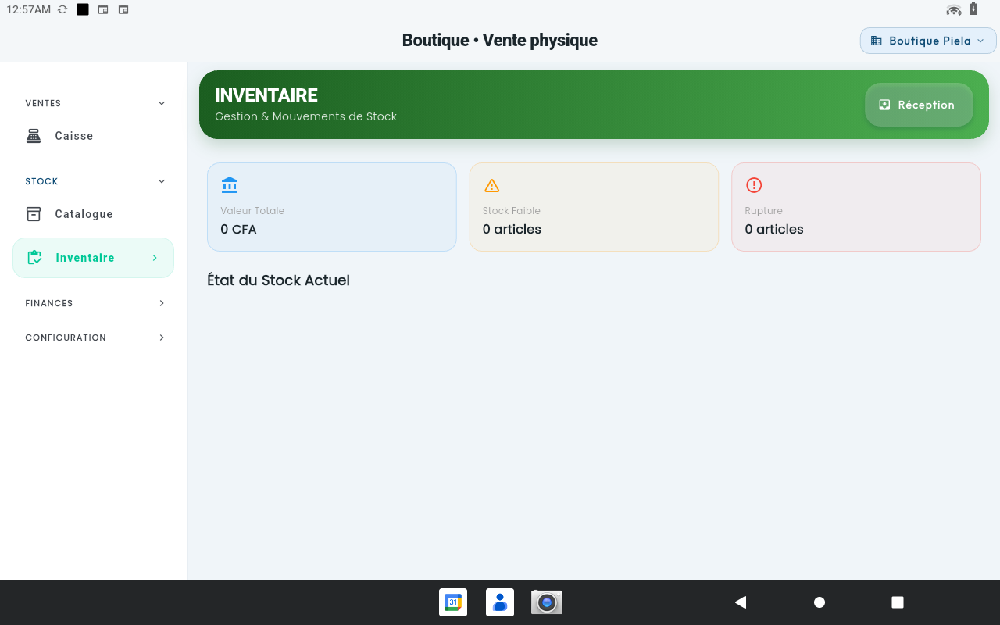 | 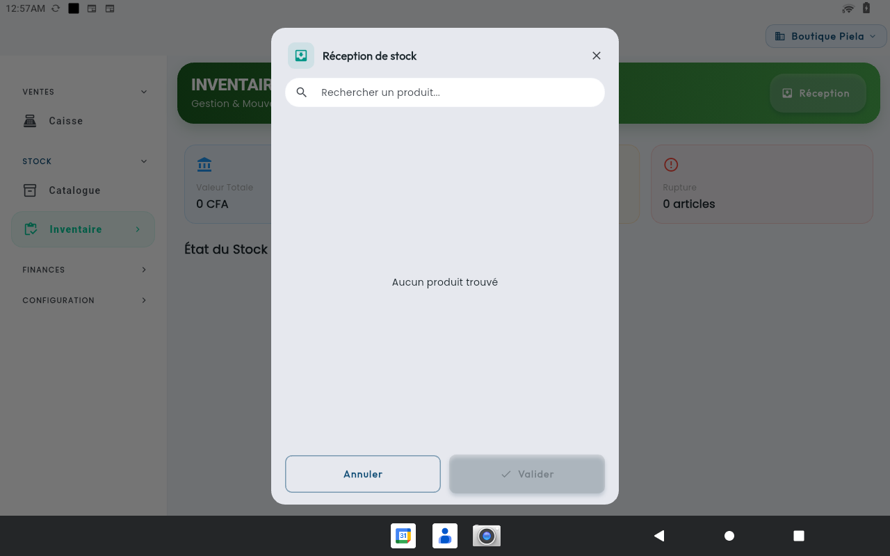 |
| KPIs valeur stock / articles / ruptures. | Dialog d'entrée de marchandises avec recherche produit. |

### 3. Finances

| Trésorerie | Créances |
| --- | --- |
| 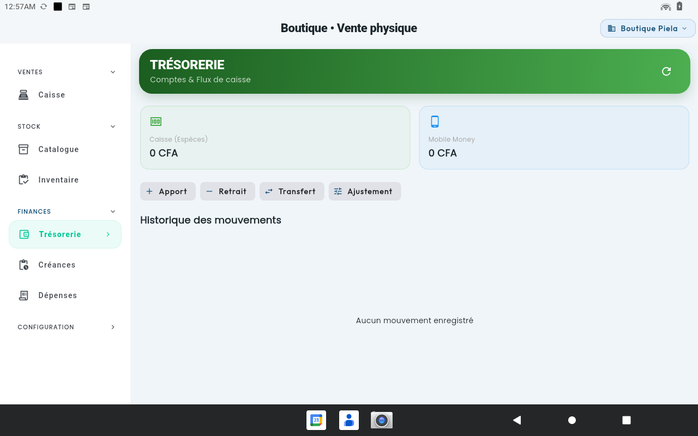 | 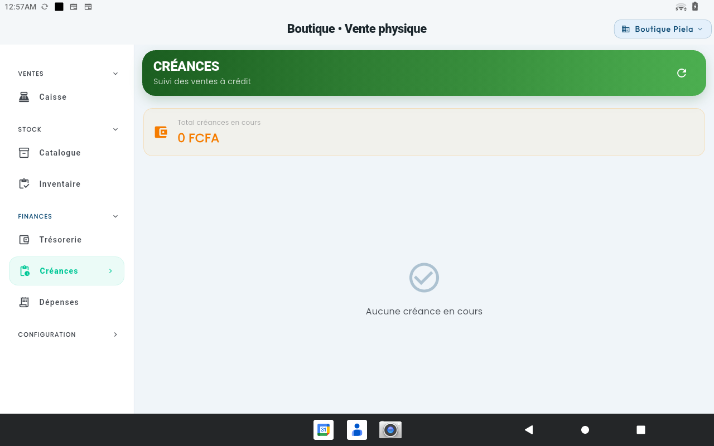 |
| Soldes Caisse / Mobile Money et 4 opérations. | Suivi des ventes à crédit avec total dû. |

| Dépenses | Nouvelle dépense |
| --- | --- |
| 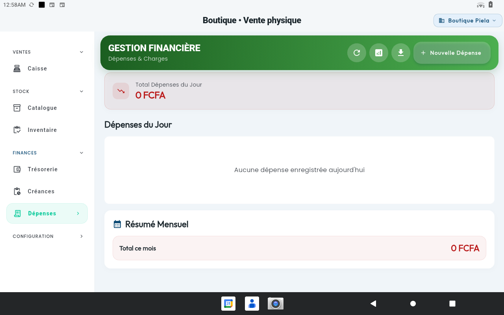 | 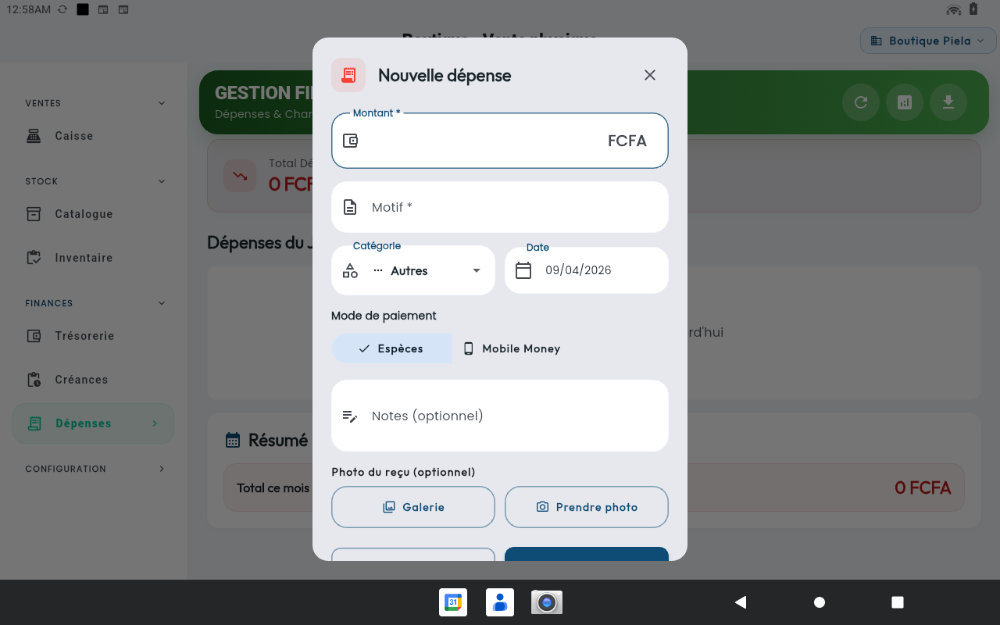 |
| Dépenses du jour + résumé mensuel. | Saisie avec catégorie, date, mode de paiement, photo du reçu. |

---

## 🛠️ Modèle de Domaine

Tous les modèles dans
[lib/features/boutique/domain/entities/](../../lib/features/boutique/domain/entities/).

### Product
```dart
class Product {
  final String id;
  final String enterpriseId;
  final String name;
  final int price;              // Prix de vente FCFA
  final int stock;
  final String? categoryId;
  final String? barcode;
  final int? purchasePrice;     // Prix d'achat FCFA
  final int lowStockThreshold;  // Seuil d'alerte (5 par défaut)
  final bool isActive;
  // soft delete
  final DateTime? deletedAt;
  final String? deletedBy;

  int? get profitMargin;            // price - purchasePrice
  double? get profitMarginPercentage;
}
```

### Sale (avec chaînage de tickets)
```dart
class Sale {
  final String id;
  final DateTime date;
  final List<SaleItem> items;
  final int totalAmount;
  final int amountPaid;
  final PaymentMethod? paymentMethod; // cash | mobileMoney | both
  final int cashAmount;               // Pour paiement mixte
  final int mobileMoneyAmount;
  final String? customerName;
  final String? number;               // FAC-YYYYMMDD-NNN
  // Chaînage cryptographique
  final String? ticketHash;
  final String? previousHash;

  bool get isCredit;          // amountPaid < totalAmount
  int get remainingAmount;
  int get change;             // amountPaid - totalAmount
}
```

Autres entités notables :
- `Category` — catégories produit
- `StockMovement` — entrées/sorties/ajustements
- `Expense` — dépenses opérationnelles
- `Purchase` / `Supplier` / `SupplierSettlement` — circuit d'achat
- `Closing` — clôture de journée (Z-Report)
- `BoutiqueSettings` — configuration par boutique

---

## 🔄 Flux Métier Clés

### Vente au comptoir

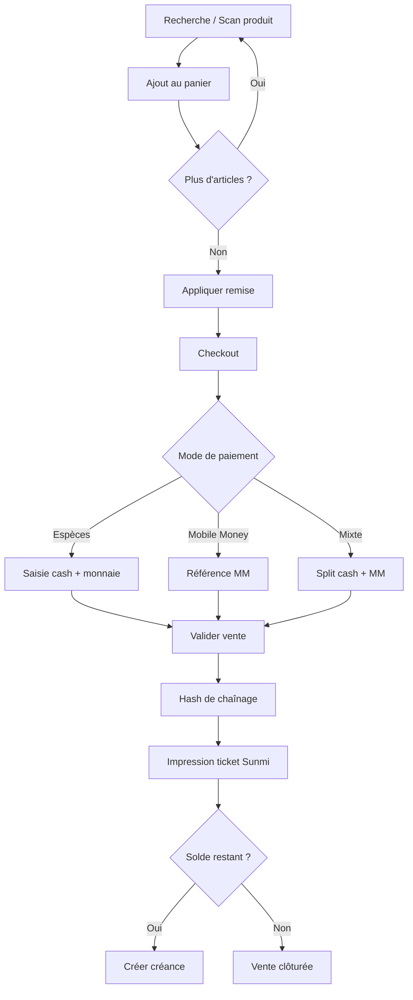

### Réception de stock

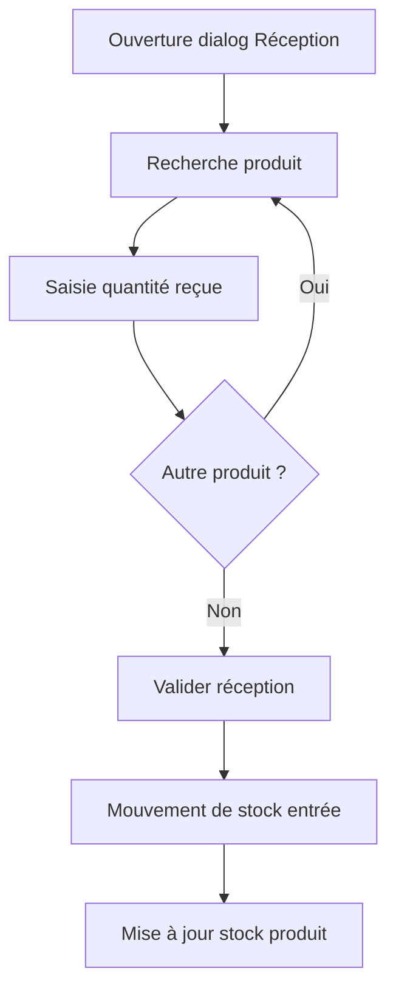

### Dépense → Trésorerie

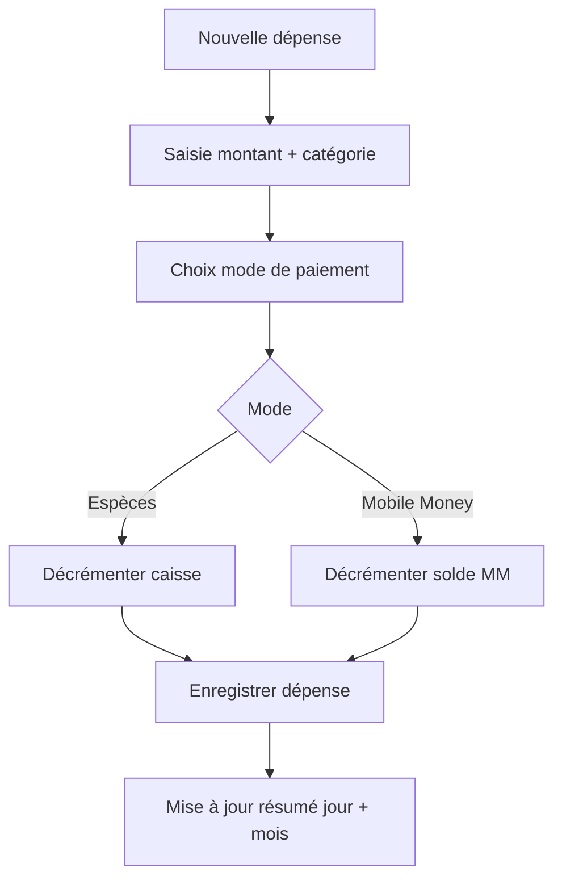

---

## 🔗 Liens Utiles

- 📁 [Code source du module](../../lib/features/boutique/)
- 📐 [Architecture](./docs/ARCHITECTURE.md)
- 📋 [Notes d'implémentation](./docs/IMPLEMENTATION.md)
- 🏠 [Retour au Portfolio](../)

---

## 📝 Notes

> **État de la Documentation** : ✅ Aligné sur l'implémentation (avril 2026)  
> **Dernière Mise à Jour** : 9 Avril 2026
