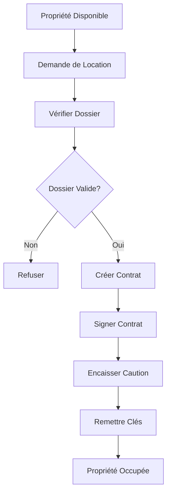
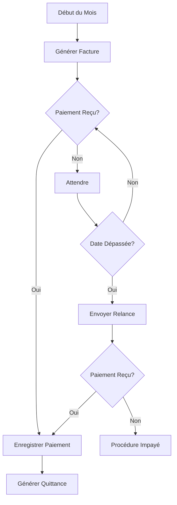
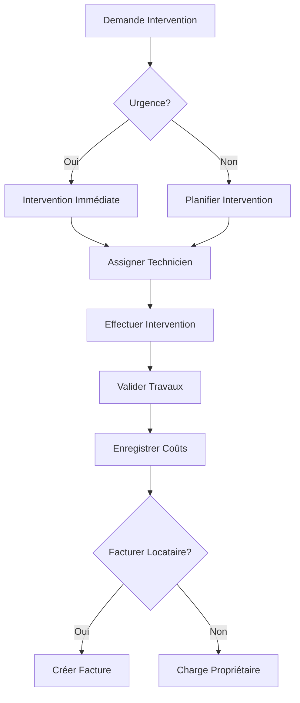

# Module Immobilier - ELYF Group App

## 🎯 Vue d'Ensemble

Le module **Immobilier** permet la gestion complète d'un portefeuille de propriétés en location. Il gère les propriétés, les locataires, les contrats de location, les paiements de loyers et la maintenance des biens.

### Caractéristiques Principales

- 🏠 **Gestion des Propriétés** - Catalogue complet des biens immobiliers
- 👥 **Gestion des Locataires** - Dossiers locataires et historique
- 📄 **Contrats de Location** - Création et suivi des baux
- 💰 **Paiements de Loyers** - Encaissement et suivi des paiements
- 🔧 **Maintenance** - Gestion des demandes et interventions
- 📊 **Rapports Financiers** - Suivi de la rentabilité

---

## ✨ Fonctionnalités Prévues

### 1. Gestion des Propriétés

#### Catalogue de Biens
- Ajout de propriétés (maisons, appartements, etc.)
- Photos et descriptions détaillées
- Caractéristiques (surface, nombre de pièces, etc.)
- Localisation et adresse

#### Statut des Propriétés
- Disponible
- Occupée
- En maintenance
- Hors service

#### Valorisation
- Prix de location
- Charges locatives
- Historique des prix
- Estimation de la valeur

### 2. Gestion des Locataires

#### Dossiers Locataires
- Informations personnelles
- Pièces d'identité
- Coordonnées
- Historique de location

#### Sélection
- Demandes de location
- Vérification des dossiers
- Validation et acceptation

### 3. Contrats de Location

#### Création de Baux
- Génération automatique de contrats
- Durée de location
- Montant du loyer
- Conditions particulières

#### Gestion des Contrats
- Renouvellement
- Résiliation
- Avenants
- Archivage

### 4. Paiements de Loyers

#### Encaissement
- Enregistrement des paiements
- Paiements en espèces
- Paiements mobiles
- Virements bancaires

#### Suivi
- Loyers en retard
- Relances automatiques
- Historique des paiements
- Quittances de loyer

#### Charges
- Eau, électricité
- Entretien commun
- Taxes
- Répartition des charges

### 5. Maintenance

#### Demandes d'Intervention
- Signalement par les locataires
- Catégorisation (urgence, normale)
- Assignation aux techniciens

#### Suivi des Interventions
- Planification
- Statut (en attente, en cours, terminée)
- Coûts
- Historique

### 6. Rapports & Analytics

#### Financiers
- Revenus locatifs mensuels
- Taux d'occupation
- Loyers impayés
- Rentabilité par propriété

#### Opérationnels
- Taux de rotation des locataires
- Durée moyenne de location
- Nombre d'interventions
- Coûts de maintenance

---

## 🔄 Flux de Travail Théorique

### Flux de Location



### Flux de Paiement de Loyer



### Flux de Maintenance



---

## 📸 Screenshots

Captures réalisées sur tablette (mode sombre, locale FR). Les écrans illustrent
les principaux parcours du module : vue d'ensemble, finances, gestion immobilière,
rapports et configuration.

### 1. Vue d'Ensemble

| Tableau de bord |
| --- |
|  |
| Synthèse des revenus, paiements reçus et tendance mensuelle. |

### 2. Finances

| Paiements reçus | Loyers en retard |
| --- | --- |
|  |  |
| Liste chronologique des encaissements avec recherche multi-critères. | Suivi des locataires en souffrance avec actions de relance rapide. |

| Dépenses | Nouvelle dépense |
| --- | --- |
|  |  |
| Vue filtrable des charges sur la période. | Saisie d'une dépense rattachée à une propriété. |

#### Parcours d'encaissement (assistant en 2 étapes)

| Étape 1 — Locataire | Étape 2 — Maison | Sélection des mois |
| --- | --- | --- |
|  |  |  |
| Choix du locataire à encaisser. | Choix de la maison rattachée au locataire. | Sélection des mois impayés et du montant. |

| Trésorerie |
| --- |
|  |
| Historique des mouvements caisse / banque avec soldes consolidés. |

### 3. Gestion Immobilière

| Locataires | Propriétés |
| --- | --- |
|  |  |
| Annuaire avec filtres "À jour / En retard". | Catalogue des biens avec statut d'occupation et loyer mensuel. |

### 4. Rapports

| Rapports analytiques |
| --- |
|  |
| Période personnalisable, KPIs financiers (revenus, dépenses, bénéfice net, taux d'occupation) et détail par paiement. |

### 5. Configuration

| Profil & Sécurité |
| --- |
|  |
| Gestion du compte, mot de passe et déconnexion. |

---

## 🛠️ Détails Techniques

### Modèles de Données Prévus

#### Property
```dart
class Property {
  final String id;
  final String name;
  final String address;
  final PropertyType type; // house, apartment, etc.
  final int rooms;
  final double surface;
  final double monthlyRent;
  final PropertyStatus status;
  final List<String> imageUrls;
}
```

#### Tenant
```dart
class Tenant {
  final String id;
  final String fullName;
  final String phone;
  final String email;
  final String idNumber;
  final List<String> documentUrls;
  final TenantStatus status;
}
```

#### LeaseContract
```dart
class LeaseContract {
  final String id;
  final String propertyId;
  final String tenantId;
  final DateTime startDate;
  final DateTime endDate;
  final double monthlyRent;
  final double deposit;
  final ContractStatus status;
}
```

#### RentPayment
```dart
class RentPayment {
  final String id;
  final String contractId;
  final DateTime dueDate;
  final DateTime? paidDate;
  final double amount;
  final PaymentStatus status;
  final PaymentMethod? method;
}
```

#### MaintenanceRequest
```dart
class MaintenanceRequest {
  final String id;
  final String propertyId;
  final String tenantId;
  final String description;
  final RequestPriority priority;
  final RequestStatus status;
  final double? cost;
  final DateTime createdAt;
  final DateTime? completedAt;
}
```

---

## 📊 Roadmap

### Phase 1 : Fonctionnalités de Base
- [ ] Gestion du catalogue de propriétés
- [ ] Gestion des locataires
- [ ] Création de contrats de location
- [ ] Dashboard basique

### Phase 2 : Paiements
- [ ] Enregistrement des paiements de loyers
- [ ] Génération de quittances
- [ ] Suivi des impayés
- [ ] Relances automatiques

### Phase 3 : Maintenance
- [ ] Demandes d'intervention
- [ ] Assignation aux techniciens
- [ ] Suivi des interventions
- [ ] Gestion des coûts

### Phase 4 : Fonctionnalités Avancées
- [ ] Génération automatique de contrats PDF
- [ ] Notifications SMS/Email
- [ ] Rapports financiers détaillés
- [ ] Prédiction des revenus

---

## 🔗 Liens Utiles

- [Documentation Technique Complète](../../docs/technical/)
- [Wiki du Projet](../../wiki/)
- [Architecture Globale](../../docs/DOCUMENTATION_STRUCTURE.md)
- [Retour au Portfolio Principal](../)

---

## 📝 Notes

> **État de la Documentation** : 📸 Screenshots intégrés  
> **Dernière Mise à Jour** : 9 Avril 2026  
> **Version du Module** : En développement
