# Module Immobilier — ELYF Group App

## 🎯 Vue d'Ensemble

Le module **Immobilier** gère un **portefeuille de propriétés en location** :
catalogue des biens, annuaire des locataires, contrats de bail, encaissement
des loyers (avec facturation automatique des échéances et **génération de
quittances PDF**), suivi des loyers en retard, dépenses par bien et rapports
analytiques de rentabilité.

L'architecture est **offline-first** : toutes les opérations passent par une
base locale (Drift) et se synchronisent avec le backend. Le module est aligné
sur l'implémentation réelle (avril 2026) — module **production-ready** avec
8 repositories et 7 controllers dédiés.

### Caractéristiques Principales

- 🏠 **Gestion des propriétés** — catalogue des biens, statut d'occupation, loyer mensuel
- 👥 **Annuaire des locataires** — dossiers, statut « à jour / en retard »
- 📄 **Contrats de bail** — rattachement locataire ↔ propriété, dates, loyer, caution
- 💰 **Encaissement de loyers** — assistant 2 étapes (Locataire → Maison → Mois à payer)
- ⚠️ **Suivi des impayés** — échéances en retard + relance
- 🧾 **Quittances PDF** — génération automatique + partage natif Android
- 🤖 **Facturation automatique** — échéances mensuelles générées le 1er du mois
- 💵 **Trésorerie consolidée** — caisse + banque
- 📊 **Rapports analytiques** — revenus, dépenses, bénéfice net, taux d'occupation

Code source : [lib/features/immobilier/](../../lib/features/immobilier/)

---

## 🧩 Architecture Fonctionnelle

Navigation latérale en plusieurs sections (visibilité conditionnée par les
permissions [immobilier_permissions.dart](../../lib/core/permissions/modules/immobilier_permissions.dart)) :

| Section | Écrans |
| --- | --- |
| **Vue d'ensemble** | Tableau de Bord |
| **Finances** | Paiements · Retards · Dépenses · Trésorerie |
| **Gestion** | Locataires · Propriétés |
| **Rapports** | Rapports analytiques |
| **Configuration** | Profil & sécurité |

---

## ✨ Fonctionnalités Implémentées

### 1. Tableau de Bord

[dashboard_screen.dart](../../lib/features/immobilier/presentation/screens/sections/dashboard_screen.dart)

- Synthèse des **revenus**, **paiements reçus** et **tendance mensuelle**
- Agrégats calculés par `DashboardCalculationService` / `PropertyCalculationService`
  (revenus par propriété, taux d'occupation, rentabilité)

### 2. Encaissement de Loyers — Assistant 2 étapes

[payments_screen.dart](../../lib/features/immobilier/presentation/screens/sections/payments_screen.dart)

Flux guidé en 2 étapes :

1. **Locataire** — sélection du locataire à encaisser (recherche + filtre « à jour / en retard »)
2. **Maison** — sélection de la propriété rattachée au locataire
3. **Mois à payer** — l'utilisateur coche les échéances impayées ; `PaymentController`
   calcule le total dû, applique le paiement et marque les mois comme soldés
4. Génération automatique de la **quittance PDF** via `ReceiptService`

> Toute écriture **doit** passer par `PaymentController.recordRentPayment()` pour
> garantir la cohérence échéances ↔ paiements ↔ quittance.

### 3. Suivi des Impayés

[payments_screen.dart](../../lib/features/immobilier/presentation/screens/sections/payments_screen.dart)

- **Loyers en retard** — suivi des locataires en souffrance avec actions de relance rapide
- **Facturation automatique** : `BillingAutomationService` génère les échéances
  mensuelles sur tous les contrats actifs (le 1er du mois) et met à jour le statut
  « en retard » dès qu'une échéance dépasse la date butoir

### 4. Dépenses par Propriété

[expenses_screen.dart](../../lib/features/immobilier/presentation/screens/sections/expenses_screen.dart)

- Vue filtrable des charges sur la période
- Saisie d'une **dépense rattachée à une propriété**
- Impact direct sur la rentabilité calculée dans les rapports

### 5. Trésorerie

[treasury_screen.dart](../../lib/features/immobilier/presentation/screens/sections/treasury_screen.dart)

- Historique des mouvements **Caisse / Banque** avec **soldes consolidés**
- Géré par `immobilier_treasury_controller`

### 6. Gestion Locataires & Propriétés

[tenants_screen.dart](../../lib/features/immobilier/presentation/screens/sections/tenants_screen.dart)
· [properties_screen.dart](../../lib/features/immobilier/presentation/screens/sections/properties_screen.dart)

- **Locataires** : annuaire avec filtres « À jour / En retard », dossiers et documents
- **Propriétés** : catalogue des biens avec **statut d'occupation** et **loyer mensuel**

### 7. Rapports Analytiques

[reports_screen.dart](../../lib/features/immobilier/presentation/screens/sections/reports_screen.dart)

- Période personnalisable
- KPIs financiers : **revenus**, **dépenses**, **bénéfice net**, **taux d'occupation**
- Détail par paiement et calcul de rentabilité par propriété

### 8. Configuration

[immobilier_shell_screen.dart](../../lib/features/immobilier/presentation/screens/immobilier_shell_screen.dart)

Profil utilisateur, sécurité (mot de passe) et déconnexion.

---

## 📸 Screenshots

> Captures réalisées sur tablette en mode sombre, locale FR.

### 1. Vue d'Ensemble

| Tableau de bord |
| --- |
| 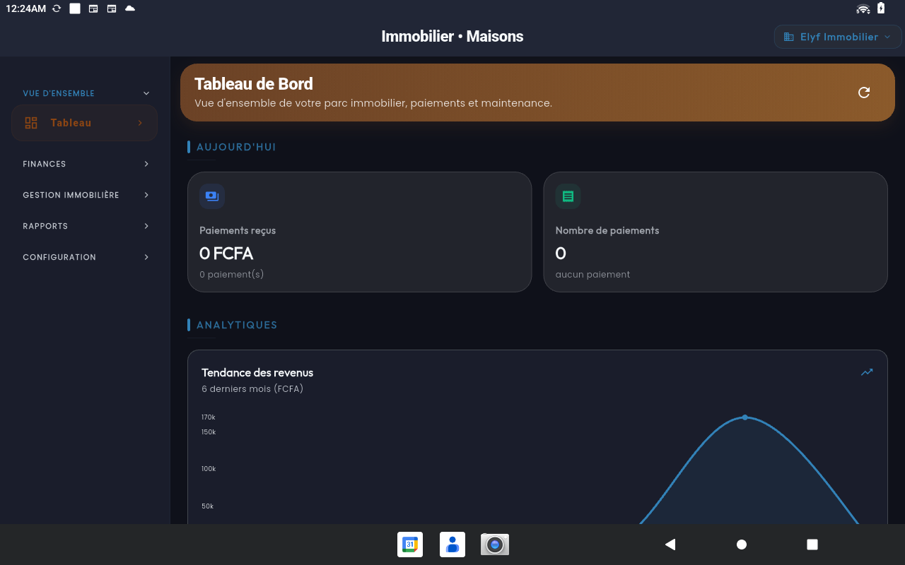 |
| Synthèse des revenus, paiements reçus et tendance mensuelle. |

### 2. Finances

| Paiements reçus | Loyers en retard |
| --- | --- |
| 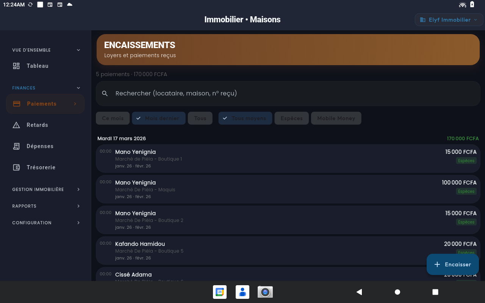 | 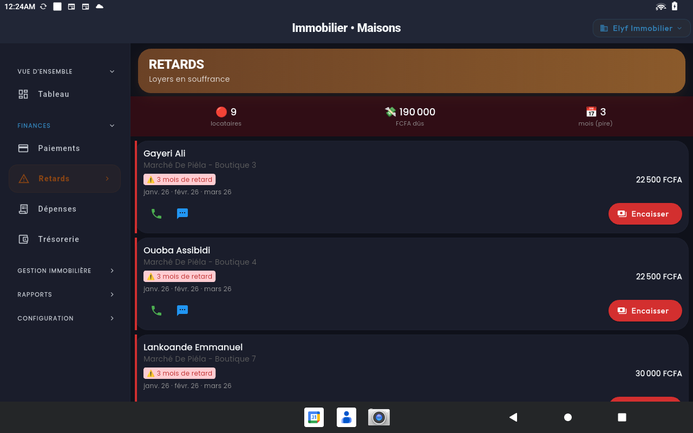 |
| Liste chronologique des encaissements avec recherche multi-critères. | Suivi des locataires en souffrance avec actions de relance rapide. |

| Dépenses | Nouvelle dépense |
| --- | --- |
| 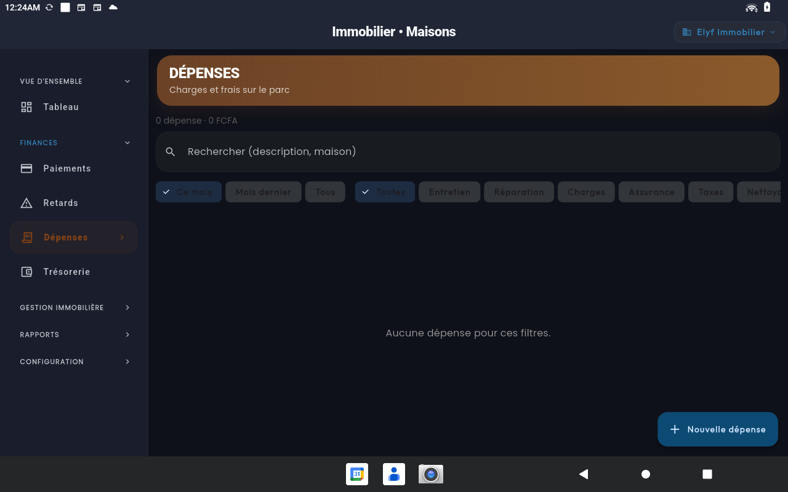 | 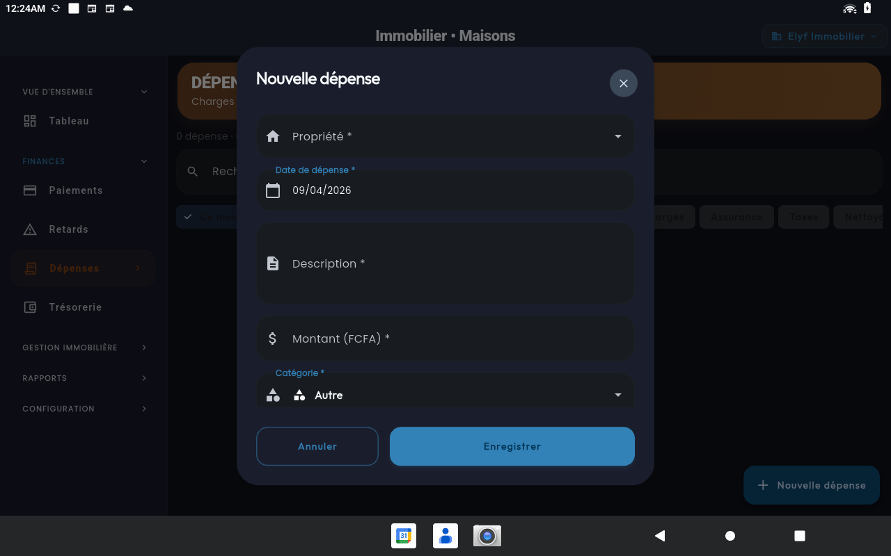 |
| Vue filtrable des charges sur la période. | Saisie d'une dépense rattachée à une propriété. |

#### Parcours d'encaissement (assistant 2 étapes)

| Étape 1 — Locataire | Étape 2 — Maison | Sélection des mois |
| --- | --- | --- |
| 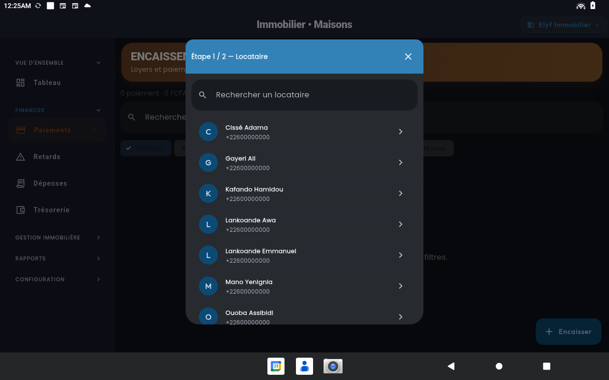 | 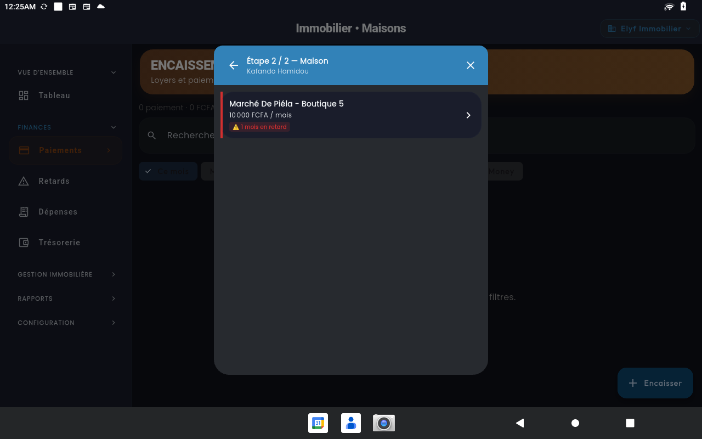 | 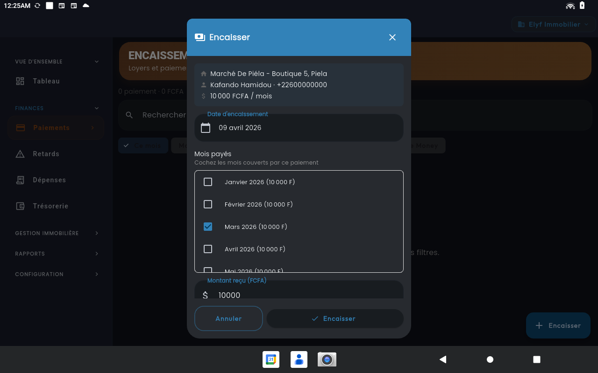 |
| Choix du locataire à encaisser. | Choix de la maison rattachée au locataire. | Sélection des mois impayés et du total dû. |

| Trésorerie |
| --- |
| 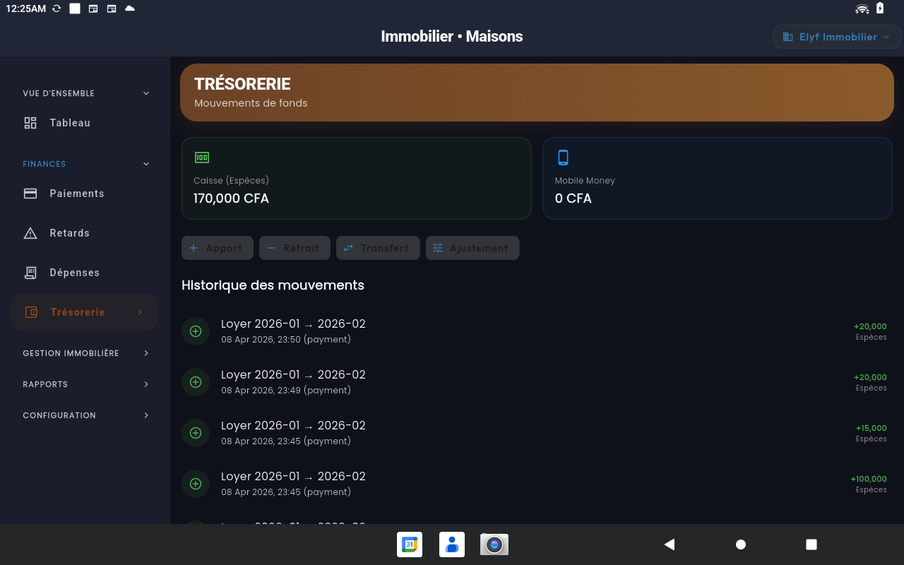 |
| Historique des mouvements caisse / banque avec soldes consolidés. |

### 3. Gestion

| Locataires | Propriétés |
| --- | --- |
| 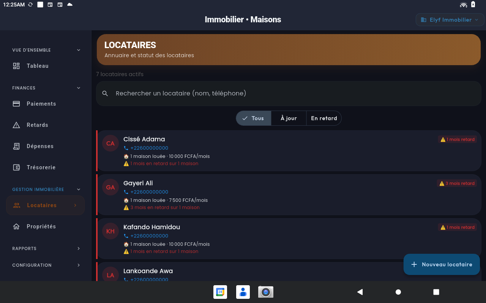 | 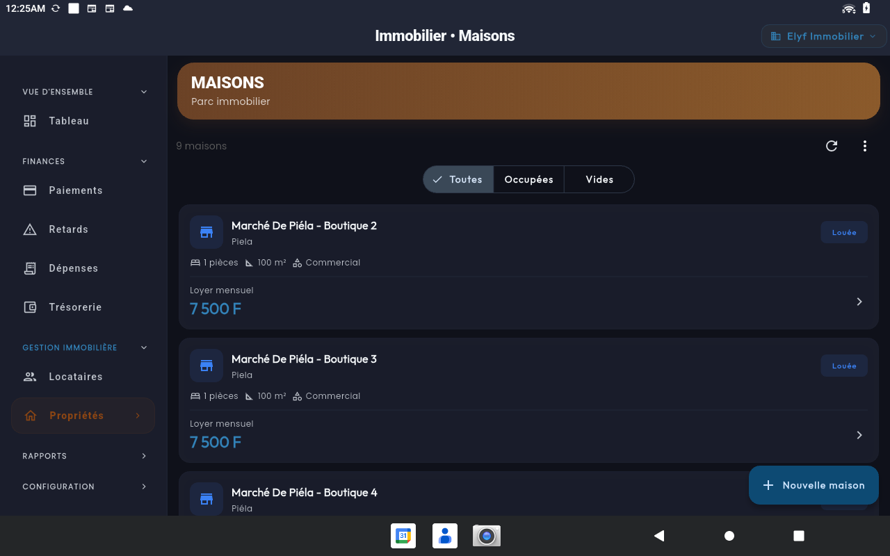 |
| Annuaire avec filtres « À jour / En retard ». | Catalogue des biens avec statut d'occupation et loyer mensuel. |

### 4. Rapports

| Rapports analytiques |
| --- |
| 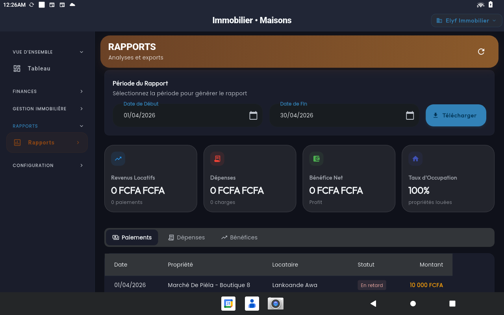 |
| Période personnalisable, KPIs financiers (revenus, dépenses, bénéfice net, taux d'occupation) et détail par paiement. |

### 5. Configuration

| Profil & Sécurité |
| --- |
| 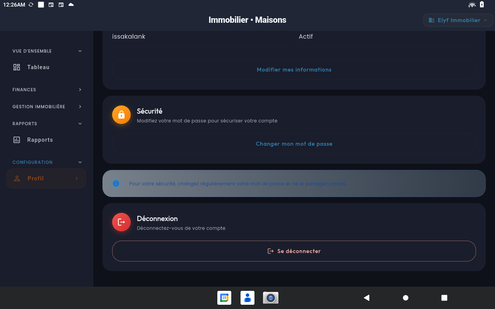 |
| Gestion du compte, mot de passe et déconnexion. |

---

## 🛠️ Modèle de Domaine

Tous les modèles sont définis dans
[lib/features/immobilier/domain/entities/](../../lib/features/immobilier/domain/entities/).

### Property
```dart
class Property {
  final String id;
  final String name;
  final String address;
  final PropertyType type;      // house, apartment, etc.
  final int rooms;
  final double surface;
  final double monthlyRent;
  final PropertyStatus status;  // occupation
  final List<String> imageUrls;
}
```

### Tenant
```dart
class Tenant {
  final String id;
  final String fullName;
  final String phone;
  final String email;
  final String idNumber;
  final List<String> documentUrls;
  final TenantStatus status;    // "à jour" / "en retard"
}
```

### Payment
```dart
class Payment {
  final String id;
  final String contractId;
  final List<DateTime> monthsCovered;  // mois couverts par le paiement
  final double amount;
  final PaymentMethod method;
  final DateTime paidAt;
}
```

Autres entités notables :
- `Contract` — bail (locataire ↔ propriété, dates, loyer, caution)
- `Expense` / `PropertyExpense` — dépense rattachée à une propriété
- `MaintenanceTicket` — demande/intervention de maintenance
- `ImmobilierSettings` — configuration du module
- `ReportPeriod` — période de rapport

---

## 🔄 Flux Métier Clés

### Cycle de Facturation & Encaissement

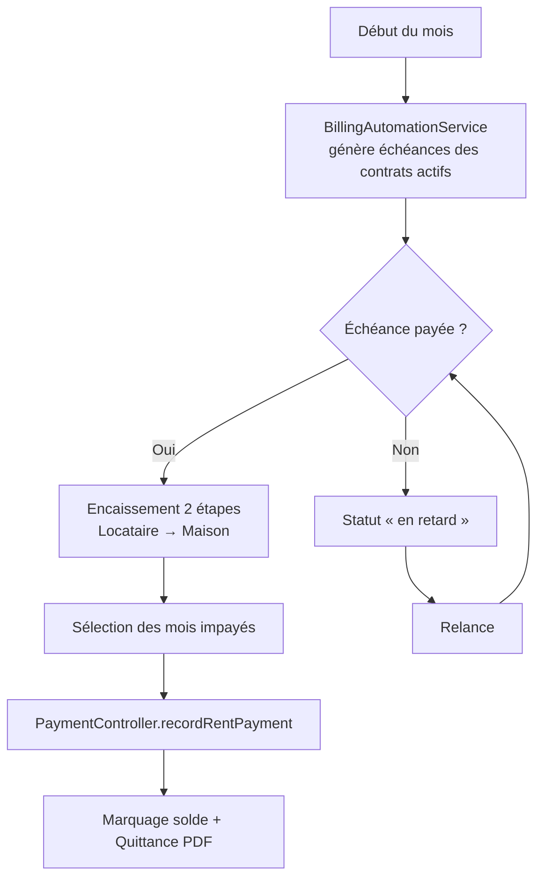

### Cycle de Rentabilité

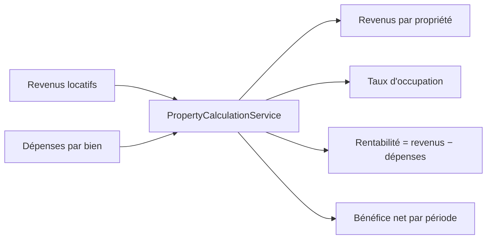

---

## 🔗 Liens Utiles

- 📁 [Code source du module](../../lib/features/immobilier/)
- 📐 [Architecture](./docs/ARCHITECTURE.md)
- 📋 [Notes d'implémentation](./docs/IMPLEMENTATION.md)
- 🏠 [Retour au Portfolio](../)

---

## 📝 Notes

> **État de la Documentation** : ✅ Aligné sur l'implémentation (avril 2026)  
> **Module** : Production-ready (8 repositories, 7 controllers, services de calcul & automatisation)  
> **Dernière Mise à Jour** : Avril 2026
